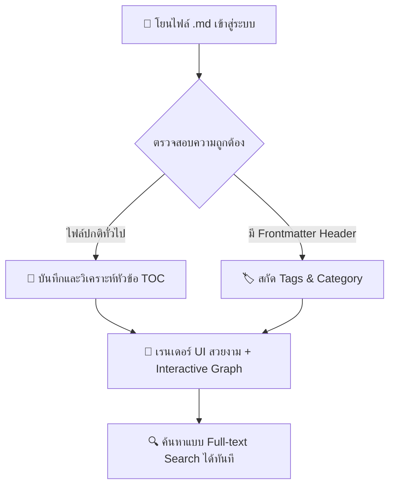
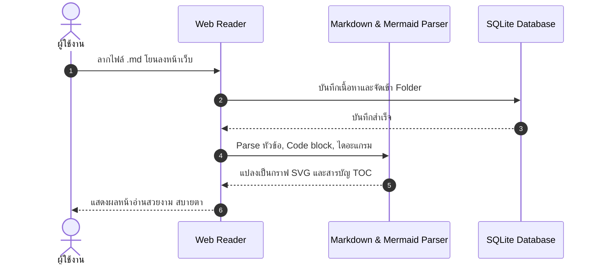
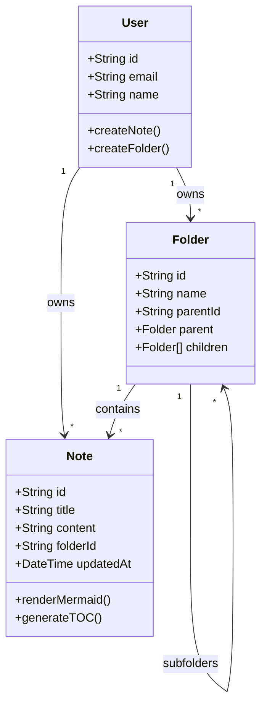

# คู่มือและมาตรฐานโครงสร้างไฟล์ Markdown (Note Contract)

ไฟล์นี้เป็นตัวอย่าง **Contract รูปแบบไฟล์ Markdown** ที่ระบบ Markdown Vault รองรับอย่างเต็มรูปแบบ พร้อมสาธิตการวาดกราฟและไดอะแกรมด้วย Mermaid

---

## 1. การวาดกราฟและ Flowchart ในไฟล์ .md

คุณสามารถใส่บล็อกโค้ด \`\`\`mermaid แล้ววาดกราฟ Flowchart, Sequence, State หรือ Mindmap ได้ทันที:

---

## 2. ตัวอย่าง Sequence Diagram (การทำงานของระบบ)

---

## 3. ตัวอย่าง Class Diagram (Contract สถาปัตยกรรมข้อมูล)

---

## 4. มาตรฐาน Contract กลางสำหรับไฟล์ Markdown ที่แนะนำ

ระบบของเรารองรับไฟล์ `.md` ทั่วไปได้ทุกแบบ **(100% Flexible)** แต่หากต้องการให้จัดโครงสร้างได้สมบูรณ์แบบ แนะนำให้มีโครงสร้างดังนี้:

### โครงสร้างที่แนะนำ:
1. **Frontmatter (ถ้ามี)**: ใช้ \`---\` ปิดหัวท้าย เพื่อระบุ Metadata เช่น \`title\`, \`category\`, \`tags\`
2. **Heading 1 (\`# หัวข้อหลัก\`)**: เป็นชื่อเรื่องของเอกสาร
3. **Heading 2 & 3 (\`##\`, \`###\`)**: ใช้แบ่งหัวข้อย่อย ซึ่งระบบจะดึงไปทำ **สารบัญ (TOC)** ด้านขวามือให้เองอัตโนมัติ
4. **Mermaid Block**: เขียนโค้ดกราฟในบล็อก \`\`\`mermaid ระบบจะวาดเป็นกราฟ Interactive ให้ทันที
5. **Code Blocks**: ระบุชื่อภาษา เช่น \`\`\`typescript หรือ \`\`\`python เพื่อไฮไลต์สีโค้ด
